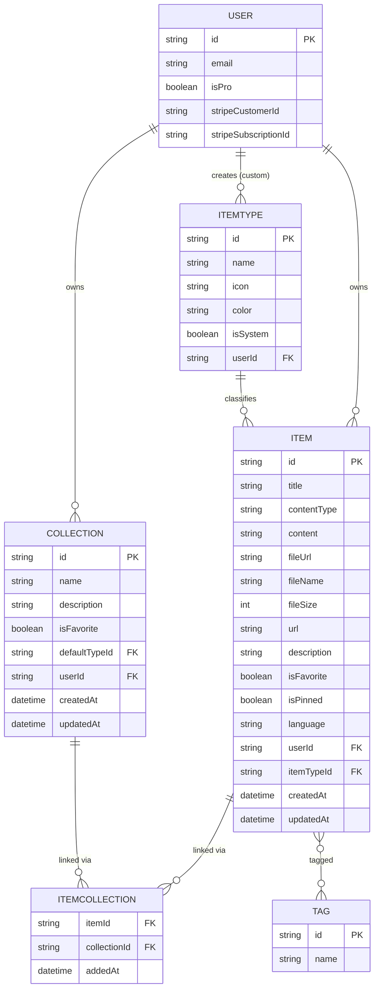
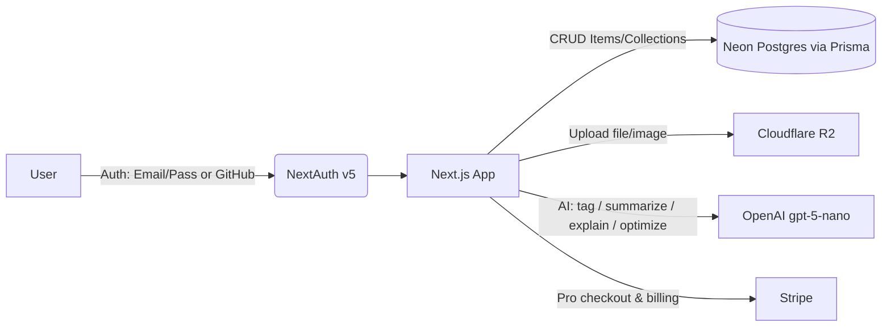

# CodeKeep — Project Overview

## 1. Problem

Developers keep their essentials scattered across too many tools:

- 📝 Code snippets — VS Code, Notion
- 🤖 AI prompts — buried in chat history
- 📁 Context files — buried in projects
- 🔗 Useful links — bookmarks
- 📄 Docs — random folders
- 💻 Commands — `.txt` files
- 📦 Project templates — GitHub Gists
- ⌨️ Terminal commands — bash history

This fragmentation causes constant context-switching, lost knowledge, and inconsistent workflows.

**CodeKeep** is one fast, searchable, AI-enhanced hub for all developer knowledge and resources.

---

## 2. Target Users

| Persona | Core Need |
|---|---|
| **Everyday Developer** | Fast access to snippets, prompts, commands, links |
| **AI-First Developer** | A home for prompts, contexts, workflows, system messages |
| **Content Creator / Educator** | Storage for code blocks, explanations, course notes |
| **Full-Stack Builder** | A library of patterns, boilerplate, API examples |

---

## 3. Features

### A. Items & Item Types

Items are typed. Users can eventually create **custom types**, but the app ships with fixed **system types** (not user-editable):

| Type | Content Kind |
|---|---|
| `snippet` | text |
| `prompt` | text |
| `note` | text |
| `command` | text |
| `link` | url |
| `file` *(Pro)* | file |
| `image` *(Pro)* | file |

- Items should be quick to create and view — via a **drawer**, not a full page reload.
- Route convention: `/items/[type]` (e.g. `/items/snippets`).

### B. Collections

- Collections can hold items of **any type**.
- Items support a **many-to-many** relationship with collections (e.g. a React snippet can live in both "React Patterns" and "Interview Prep").

Examples:
- React Patterns *(snippets, notes)*
- Context Files *(files)*
- Python Snippets *(snippets)*

### C. Search

Full search across:
- Content
- Tags
- Titles
- Types

### D. Authentication

- Email/password
- GitHub OAuth

### E. Core Features

- ⭐ Favorite collections & items
- 📌 Pin items to top
- 🕒 Recently used
- 📥 Import code from a file
- ✍️ Markdown editor for text-based types
- 📤 File upload for `file` / `image` types
- 📦 Export data (multiple formats)
- 🌙 Dark mode (default)
- 🔀 Add/remove an item across multiple collections
- 👁️ View which collections an item belongs to

### F. AI Features *(Pro only)*

- Auto-tag suggestions
- AI summaries
- "Explain this code"
- Prompt optimizer

---

## 4. Data Model

### Entity Relationship Diagram



### Prisma Schema (draft)

```prisma
// schema.prisma
// Generator & datasource configured separately (Neon Postgres)

model User {
  id                   String    @id @default(cuid())
  // ...NextAuth-managed fields (name, email, image, accounts, sessions)

  isPro                Boolean   @default(false)
  stripeCustomerId     String?   @unique
  stripeSubscriptionId String?   @unique

  items                Item[]
  collections          Collection[]
  itemTypes            ItemType[] // custom types only; null userId = system type

  createdAt            DateTime  @default(now())
  updatedAt            DateTime  @updatedAt
}

model Item {
  id            String   @id @default(cuid())
  title         String
  contentType   ContentType
  content       String?  // text content, null if file/link
  fileUrl       String?  // R2 URL, null if not a file
  fileName      String?
  fileSize      Int?
  url           String?  // for link type
  description   String?
  isFavorite    Boolean  @default(false)
  isPinned      Boolean  @default(false)
  language      String?  // optional, for syntax highlighting

  user          User     @relation(fields: [userId], references: [id])
  userId        String

  itemType      ItemType @relation(fields: [itemTypeId], references: [id])
  itemTypeId    String

  tags          Tag[]
  collections   ItemCollection[]

  createdAt     DateTime @default(now())
  updatedAt     DateTime @updatedAt

  @@index([userId])
  @@index([itemTypeId])
}

model ItemType {
  id         String   @id @default(cuid())
  name       String
  icon       String
  color      String
  isSystem   Boolean  @default(false)

  user       User?    @relation(fields: [userId], references: [id])
  userId     String?  // null for system types

  items      Item[]
  collections Collection[] @relation("DefaultType")

  @@unique([userId, name])
}

model Collection {
  id             String   @id @default(cuid())
  name           String
  description    String?
  isFavorite     Boolean  @default(false)

  defaultType    ItemType? @relation("DefaultType", fields: [defaultTypeId], references: [id])
  defaultTypeId  String?

  user           User     @relation(fields: [userId], references: [id])
  userId         String

  items          ItemCollection[]

  createdAt      DateTime @default(now())
  updatedAt      DateTime @updatedAt

  @@index([userId])
}

model ItemCollection {
  item         Item       @relation(fields: [itemId], references: [id])
  itemId       String
  collection   Collection @relation(fields: [collectionId], references: [id])
  collectionId String
  addedAt      DateTime   @default(now())

  @@id([itemId, collectionId])
}

model Tag {
  id    String @id @default(cuid())
  name  String @unique
  items Item[]
}

enum ContentType {
  TEXT
  FILE
  URL
}
```

> **Migration policy:** never use `prisma db push` or manually alter the DB. All schema changes ship as Prisma migrations, run in dev then promoted to prod.

---

## 5. Tech Stack

| Layer | Choice |
|---|---|
| Framework | Next.js 16 / React 19 (SSR pages, dynamic components) |
| Backend | Next.js API routes (items, file uploads, AI calls) |
| Language | TypeScript |
| Database | Neon (PostgreSQL) |
| ORM | Prisma 7 *(check latest docs before implementing)* |
| Caching | Redis *(maybe / stretch goal)* |
| File Storage | Cloudflare R2 |
| Auth | NextAuth v5 (Email/password + GitHub OAuth) |
| AI | OpenAI `gpt-5-nano` |
| Styling | Tailwind CSS v4 + shadcn/ui |
| Repo structure | Single codebase/repo |

---

## 6. Monetization — Freemium

| | **Free** | **Pro** — $8/mo or $72/yr |
|---|---|---|
| Items | 50 total | Unlimited |
| Collections | 3 | Unlimited |
| System types | All except file/image | All |
| Custom types | ❌ | ✅ *(later)* |
| File & image uploads | ❌ | ✅ |
| Search | Basic | Basic |
| AI auto-tagging | ❌ | ✅ |
| AI code explanation | ❌ | ✅ |
| AI prompt optimizer | ❌ | ✅ |
| Export data (JSON/ZIP) | ❌ | ✅ |
| Support | Standard | Priority |

**Dev note:** build the Pro gating scaffolding now, but leave all features unlocked for all users during development.

---

## 7. UI/UX

### General Direction
- Modern, minimal, developer-focused
- Dark mode by default, light mode optional
- Clean typography, generous whitespace
- Subtle borders and shadows
- Inspiration: **Notion**, **Linear**, **Raycast**
- Syntax highlighting in code blocks

## Screenshots

Refer to the sceenshots below a base for the dashboard UI. It does not have to be exact. Use it as a reference:
- @context/screenshots/dashboard-ui-main.png
- @context/screenshots/dashboard-ui-drawer.png

### Layout
- **Sidebar** *(collapsible → drawer on mobile)*: item types with links (Snippets, Commands, etc.), latest collections
- **Main area**: grid of collection cards, background-color-coded by the dominant item type they contain; items within a collection show as color-coded cards (border = type color)
- **Item detail**: opens in a quick-access drawer, not a separate page

### Type Colors & Icons (Lucide)

| Type | Color | Hex | Icon |
|---|---|---|---|
| Snippet | 🔵 Blue | `#3b82f6` | `Code` |
| Prompt | 🟣 Purple | `#8b5cf6` | `Sparkles` |
| Command | 🟠 Orange | `#f97316` | `Terminal` |
| Note | 🟡 Yellow | `#fde047` | `StickyNote` |
| File | ⚪ Gray | `#6b7280` | `File` |
| Image | 🌸 Pink | `#ec4899` | `Image` |
| Link | 🟢 Emerald | `#10b981` | `Link` |

### Responsive
- Desktop-first, mobile-usable
- Sidebar collapses into a drawer on mobile

### Micro-interactions
- Smooth transitions
- Hover states on cards
- Toast notifications for actions
- Loading skeletons

---

## 8. High-Level System Flow



---

## 9. Open Questions / Things to Resolve

- [ ] Should Redis caching be in scope for v1, or purely a later optimization?
- [ ] Define exact export formats (JSON only, or JSON + ZIP of files?).
- [ ] Decide on rate limits / abuse prevention for AI endpoints, especially for free-tier trial access during dev.
- [ ] Custom item types (Pro, "later") — rough scope this out even if not v1.
- [ ] Confirm Prisma 7 API changes vs. current stable before scaffolding schema (flagged as "fetch latest docs" in original notes).